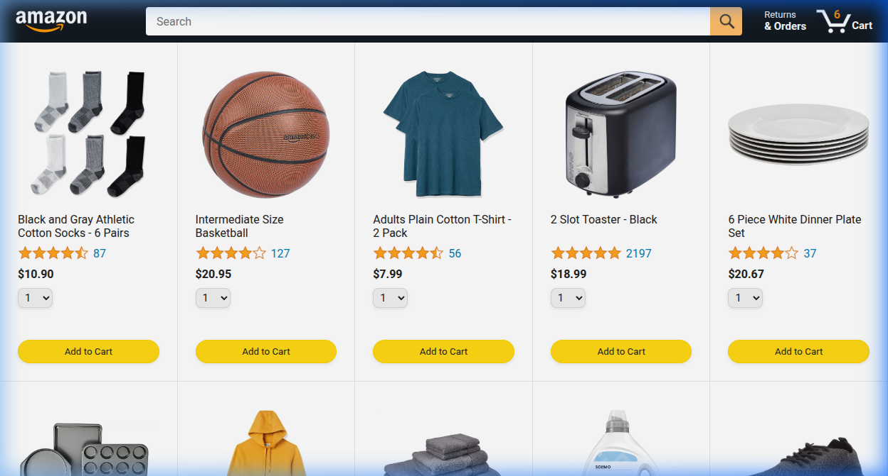
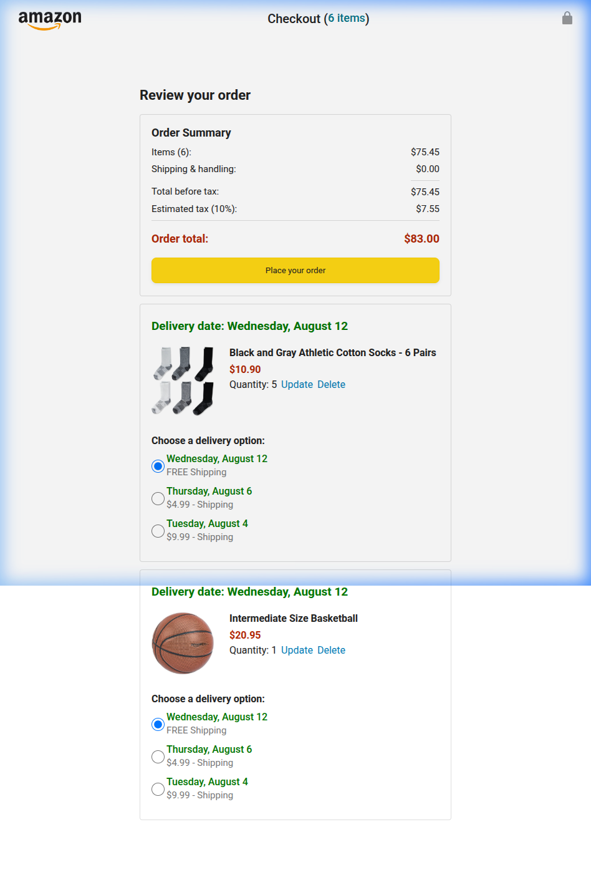

<div align="center">

# 🛒 Amazon Clone

### A fully functional e-commerce web application built with vanilla HTML, CSS & JavaScript

[](https://developer.mozilla.org/en-US/docs/Web/HTML)
[](https://developer.mozilla.org/en-US/docs/Web/CSS)
[](https://developer.mozilla.org/en-US/docs/Web/JavaScript)

[Features](#-features) • [Demo](#-demo) • [Tech Stack](#-tech-stack) • [Getting Started](#-getting-started) • [Project Structure](#-project-structure) • [License](#-license)

</div>

---

## 📸 Demo

### Product Catalog


### Checkout Experience


---


## ✨ Features

### 🏠 Product Catalog
- **Dynamic Product Rendering** — 40+ products rendered dynamically from a JavaScript data source
- **Star Ratings** — Visual star rating system with review counts
- **Product Search** — Real-time search by product name and keywords
- **Quantity Selection** — Choose quantity (1–10) before adding to cart
- **"Added" Feedback** — Visual confirmation with animated checkmark when items are added

### 🛒 Shopping Cart & Checkout
- **Persistent Cart** — Cart state saved in `localStorage` across browser sessions
- **Live Order Summary** — Automatic calculation of subtotal, shipping, tax (10%), and order total
- **Delivery Options** — Three shipping tiers with business-day delivery date calculations:
  - 📦 **FREE Shipping** — 7 business days
  - 🚚 **Standard** — 3 business days ($4.99)
  - ⚡ **Express** — 1 business day ($9.99)
- **Inline Quantity Editing** — Update or delete items directly from the checkout page
- **Smooth Animations** — Fade-out transitions on item deletion

### 📋 Order Management
- **Order History** — Placed orders stored persistently with full details
- **Order Search** — Filter past orders by product name
- **Buy Again** — One-click re-order with visual confirmation feedback
- **Order Tracking** — Package tracking page with progress bar visualization
  - Status stages: `Preparing` → `Shipped` → `Delivered`

### 📱 Responsive Design
- Fully responsive layout adapting to desktop, tablet, and mobile viewports
- Mobile-optimized header with compact logo variant

---

## 🛠 Tech Stack

| Technology | Purpose |
|:---|:---|
| **HTML5** | Semantic page structure |
| **CSS3** | Styling, responsive grid layout, animations |
| **Vanilla JavaScript** | Application logic, DOM manipulation, state management |
| **Google Fonts (Roboto)** | Typography |
| **localStorage API** | Client-side data persistence for cart & orders |

> **Zero dependencies.** No frameworks, no build tools, no package manager required — just pure HTML, CSS, and JavaScript.

---

## 🚀 Getting Started

### Prerequisites

All you need is a modern web browser (Chrome, Firefox, Edge, Safari).

### Installation

1. **Clone the repository**
   ```bash
   git clone https://github.com/Amir-Moavia/Amazon-Copy.git
   ```

2. **Navigate to the project directory**
   ```bash
   cd Amazon-Copy
   ```

3. **Open in browser**
   ```bash
   # Simply open amazon.html in your browser
   # Or use a live server extension in VS Code
   ```

> 💡 **Tip:** For the best experience, use the [Live Server](https://marketplace.visualstudio.com/items?itemName=ritwickdey.LiveServer) extension in VS Code.

---

## 📁 Project Structure

```
Amazon-Copy/
│
├── amazon.html                  # 🏠 Main product catalog page
├── checkout.html                # 🛒 Shopping cart & checkout page
├── orders.html                  # 📋 Order history page
├── tracking.html                # 📦 Package tracking page
│
├── data/
│   ├── products.js              # Product catalog (40+ items)
│   ├── cart.js                  # Cart state management (localStorage)
│   ├── deliveryOptions.js       # Shipping tiers & date calculations
│   └── orders.js                # Order persistence layer
│
├── scripts/
│   ├── amazon-javascript.js     # Product rendering, search & add-to-cart
│   ├── checkout.js              # Checkout logic, payment summary & order placement
│   ├── orders-page.js           # Order history rendering & buy-again
│   └── tracking-page.js         # Package tracking & progress bar
│
├── styles/
│   ├── shared/
│   │   ├── general.css          # Global resets, buttons & utilities
│   │   └── amazon-header.css    # Shared header component styles
│   └── pages/
│       ├── amazon.css           # Product grid layout
│       ├── orders.css           # Orders page layout
│       ├── tracking.css         # Tracking page layout
│       └── checkout/
│           ├── checkout.css     # Checkout page layout
│           └── checkout-header.css
│
├── images/
│   ├── products/                # Product images (40+ items + variations)
│   ├── ratings/                 # Star rating images (0–5 stars)
│   └── icons/                   # UI icons (cart, search, checkmark, etc.)
│
├── backend/
│   └── products.json            # Backend-ready product data (JSON)
│
└── screenshots/                 # README screenshots
```

---

## 🎯 Key Implementation Highlights

- **No Frameworks** — Entire application built with vanilla JavaScript, demonstrating deep understanding of DOM manipulation, event delegation, and state management
- **Business Day Calculator** — Delivery date calculation skips weekends for realistic shipping estimates
- **UUID Generation** — RFC 4122-compliant UUID generator for unique order IDs
- **Modular Architecture** — Clean separation of data layer, rendering logic, and event handling
- **Graceful Edge Cases** — Empty cart states, missing orders, and invalid quantities all handled with user-friendly messages

---

## 🤝 Contributing

Contributions, issues, and feature requests are welcome! Feel free to check the [issues page](https://github.com/Amir-Moavia/Amazon-Copy/issues).

1. Fork the project
2. Create your feature branch (`git checkout -b feature/AmazingFeature`)
3. Commit your changes (`git commit -m 'Add some AmazingFeature'`)
4. Push to the branch (`git push origin feature/AmazingFeature`)
5. Open a Pull Request

---

## 📄 License

This project is open source and available under the [MIT License](LICENSE).

---


## 👤 Author

**Amir Moavia**

- GitHub: [@Amir-Moavia](https://github.com/Amir-Moavia)

---

<div align="center">

⭐ **Star this repo if you   found it helpful!** ⭐

</div>
